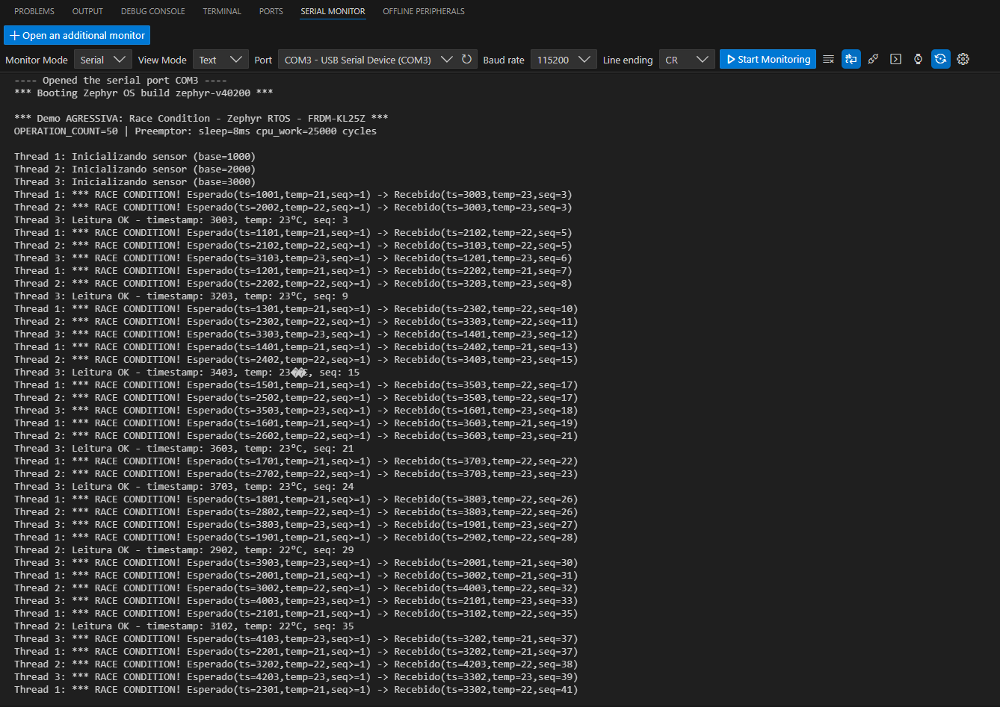

# **Henrique Santiago - 16872729** 
---

### Grupo:
* Dimitri Garcia
* Filipe Cassoli
* Henrique Santiago


---

# **1. Planejamento de Testes – Demonstração Agressiva de Race Condition no Zephyr RTOS**

## 🎯 Objetivo

Evidenciar a ocorrência de **race conditions** causadas por acesso concorrente ao recurso compartilhado `shared_sensor_data` entre múltiplas threads de sensor, sob forte preempção induzida por uma **thread de alta prioridade**, utilizando a placa **FRDM-KL25Z** e o Zephyr RTOS.

---

## 🧩 Casos de Teste 

| **Caso de Teste**                                                                                  | **Pré-condição**                                                                                                       | **Etapas de Teste**                                                                                                                                                                                                       | **Resultado Esperado**                                                                                                                                                                                                        |
| -------------------------------------------------------------------------------------------------- | ---------------------------------------------------------------------------------------------------------------------- | ------------------------------------------------------------------------------------------------------------------------------------------------------------------------------------------------------------------------- | ----------------------------------------------------------------------------------------------------------------------------------------------------------------------------------------------------------------------------- |
| **1. Execução Base com Threads Concorrentes e Preempção** *(Caso principal e obrigatório)*         | - Firmware original gravado na FRDM-KL25Z.<br>- Comunicação serial ativa a 115200 baud.<br>- LEDs da placa funcionais. | 1. Energizar a placa.<br>2. Observar atividade dos LEDs das 3 threads de sensor.<br>3. Monitorar o terminal serial.<br>4. Anotar ocorrências de `*** RACE CONDITION!`.                                                    | - Logs exibem mensagens de race condition.<br>- Dados inconsistentes de timestamp/temperatura/sequence aparecem.<br>- LED da thread que detectou o problema acende.<br>- Ao final, LEDs piscam juntos indicando falha global. |
| **2. Execução Repetida para Observação de Não-Determinismo** *(Mostra comportamento imprevisível)* | - Mesmo firmware do Caso 1.<br>- Terminal conectado.                                                                   | 1. Executar o firmware pelo menos 5 vezes (reset entre execuções).<br>2. Registrar qual thread detecta o erro primeiro em cada execução.<br>3. Comparar ordem e quantidade de erros entre execuções.                      | - A falha ocorre em execuções diferentes, porém **não de forma igual**.<br>- Ordem das mensagens e thread afetada varia.<br>- Evidencia comportamento não determinístico típico de race condition.                            |
| **3. Teste de Estresse Aumentando Preempção** *(Sensibiliza o erro para facilitar visualização)*   | - Firmware modificado para aumentar carga de CPU dentro de `cpu_work_cycles()` (ex.: dobrar valores).                  | 1. Alterar valores de `cpu_work_cycles()` para aumentar janelas de preempção.<br>2. Recompilar, gravar e executar.<br>3. Observar logs e intensidade dos LEDs.<br>4. Contar quantidade de `*** RACE CONDITION!` exibidas. | - Quantidade de erros aumenta significativamente.<br>- Race condition ocorre mais cedo e mais vezes.<br>- LEDs mostram interferência mais intensa.<br>- Demonstra que quanto maior a preempção, maior o risco de corrida.     |

---


## 🧠 Observações Importantes

* A **thread preemptora** é responsável por gerar preempção frequente, criando as janelas críticas onde o contexto muda no meio de operações não atômicas.
* A variável `shared_sensor_data` contém múltiplos campos, sendo escrita e lida parcialmente — situação clássica de race condition em estruturas compostas.
* `volatile` **não elimina** race conditions — apenas impede otimizações de compilador.
* `k_yield()` foi propositalmente adicionado para forçar mudanças de contexto nos piores momentos possíveis.

---

## 📊 Resultados Esperados

| **Indicador**                                | **Descrição**                          |
| -------------------------------------------- | -------------------------------------- |
| Logs contendo `*** RACE CONDITION!`          | Evidência direta da falha              |
| Campos inconsistentes (timestamp, temp, seq) | Prova de corrupção de dados            |
| LED da thread que detectou o problema acende | Identifica qual thread observou o erro |
| LEDs piscando juntos no final                | Indica falha global após detecção      |

---

## 🧩 Conclusão

Os testes demonstram que:

* A ausência de mecanismos de sincronização como `k_mutex`, `k_spinlock`, atomic APIs ou semáforos leva a **corrupção de dados compartilhados** em ambiente multitarefa.
* A introdução de uma thread preemptora de alta prioridade gera um cenário ideal para **exposição de race conditions ocultas**.
* O comportamento **não determinístico** observado nas execuções prova a imprevisibilidade e o risco do acesso concorrente sem proteção.


---


# **2. Planejamento de Testes – Versão Corrigida (com Mutex)**

## 🎯 Objetivo

Validar que, com o uso de `k_mutex`, o acesso concorrente ao recurso compartilhado não apresenta mais corrupção de dados, mesmo sob forte preempção e múltiplas execuções.

---

## 🧩 Casos de Teste

| **Caso de Teste**                                             | **Pré-condição**                                                                              | **Etapas de Teste**                                                                                                       | **Pós-Condição Esperada (Corrigida)**                                                                                                                                                  |
| --------------------------------------------------------- | ----------------------------------------------------------------------------------------- | --------------------------------------------------------------------------------------------------------------------- | -------------------------------------------------------------------------------------------------------------------------------------------------------------------------------------- |
| **1. Execução Base com Threads Concorrentes e Preempção** | - Firmware corrigido (com mutex) gravado na FRDM-KL25Z.<br>- Serial 115200 aberto.        | 1. Iniciar o firmware.<br>2. Observar logs e LEDs das 3 threads.<br>3. Verificar se ocorre alguma mensagem de erro.   | ✅ **Nenhuma mensagem “RACE CONDITION!” deve aparecer**.<br>✅ Valores de timestamp, temperatura e sequence sempre corretos.<br>🟢 LEDs **não entram no modo de erro** ao final.         |
| **2. Execução Repetida (5 Execuções)**                    | - Mesmo binário do Caso 1.<br>- Reset entre execuções.                                    | 1. Executar 5 vezes.<br>2. Registrar outputs.<br>3. Comparar comportamento entre execuções.                           | ✅ Resultados **idênticos e determinísticos** a cada execução.<br>✅ Mesma ordem consistente de logs.<br>✅ Nenhuma inconsistência detectada.                                             |
| **3. Teste de Estresse Aumentando Preempção**             | - Código corrigido, porém com aumento nos `cpu_work_cycles()` para estressar o scheduler. | 1. Dobrar valores do workload (ex.: 3000 → 6000).<br>2. Recompilar e executar.<br>3. Monitorar integridade dos dados. | ✅ **Ainda sem race condition**, mesmo sob carga extrema.<br>↗️ Pode ocorrer leve impacto de desempenho, porém **sem erros de dados**.<br>🟢 Integridade garantida pela exclusão mútua. |

---

## 📌 Mudanças nas Pós-Condições (em relação à versão com race)

| Antes (Sem Mutex)                  | Agora (Com Mutex)                    |
| ---------------------------------- | ------------------------------------ |
| Erros esperados                    | Erros **não devem ocorrer**          |
| Comportamento não determinístico   | Comportamento **determinístico**     |
| LEDs piscam indicando falha        | LEDs **não entram em loop de erro**  |
| Estrutura compartilhada corrompida | Dados sempre íntegros e consistentes |

---

## 🧩 Conclusão

Com o uso de `k_mutex`, confirmamos que:

✔ O problema de race condition é totalmente eliminado
✔ Os dados permanecem consistentes em todas as execuções
✔ Mesmo sob estresse, o sistema se comporta corretamente

---

# **3. Descrição da race condition e da solução**
---

## ⚠️ O que é a Race Condition neste Sistema?

No código original, três threads de “sensor” acessavam e modificavam simultaneamente um recurso compartilhado chamado `shared_sensor_data`, que contém:

```c
timestamp
temperature
sequence
initialized
```

Essas variáveis eram atualizadas por diferentes threads **sem qualquer mecanismo de sincronização**. Como o Zephyr RTOS é **preemptivo**, o escalonador pode interromper uma thread no meio da operação e passar a execução para outra — inclusive no exato instante em que a struct estava sendo modificada.

Isso causava:

### 🔴 Efeitos Observados da Race Condition

| Sintoma                                                            | Explicação                                             |
| ------------------------------------------------------------------ | ------------------------------------------------------ |
| Leituras inconsistentes do `timestamp`, `temperature` e `sequence` | Threads sobrescreviam valores umas das outras          |
| Logs com “RACE CONDITION!”                                         | Detecção de dados corrompidos após escrita concorrente |
| Comportamento não determinístico                                   | A ordem do erro mudava a cada execução                 |
| LEDs piscando simultaneamente no final                             | Indicação visual de que o recurso foi corrompido       |

> Em resumo: o código não garantia exclusividade de acesso, permitindo que **duas ou mais threads atualizassem a mesma memória ao mesmo tempo**, gerando **dados incoerentes, imprevisíveis e incorretos**.

---

## ✅ Solução Aplicada: Proteção com Mutex

Para eliminar a race condition, foi incorporado um **mutex** (Mutual Exclusion Lock), através do recurso `k_mutex` do Zephyr RTOS.

### 📍 O que o mutex garante?

O mutex garante que **apenas uma thread por vez** possa acessar e modificar o recurso compartilhado.
Ele serializa o acesso à região crítica, evitando preempção durante a operação sensível.

### 🧠 Como foi resolvido no código?

1. Foi criado um mutex global:

```c
K_MUTEX_DEFINE(sensor_mutex);
```

2. Toda a região que acessa `shared_sensor_data` foi envolvida em:

```c
k_mutex_lock(&sensor_mutex, K_FOREVER);
// acesso exclusivo ao recurso
k_mutex_unlock(&sensor_mutex);
```

3. Removeram-se atrasos/yields dentro da região crítica para evitar preempção enquanto o mutex está ativo.

### 🟢 Resultado da Correção

| Comportamento               | Antes (com race)            | Depois (com mutex)                    |
| --------------------------- | --------------------------- | ------------------------------------- |
| Valores do sensor           | Inconsistentes              | Sempre corretos                       |
| Logs                        | “RACE CONDITION!” frequente | Nenhum erro esperado                  |
| Execuções repetidas         | Diferentes a cada execução  | Resultados estáveis e determinísticos |
| Robustez sob alta preempção | Falha constante             | Total integridade do recurso          |

---

## 🎓 Explicação Simplificada

> **Antes:** várias threads entravam ao mesmo tempo na “sala” onde a variável era modificada → bagunça, mistura de valores, imprevisibilidade.

> **Depois:** só entra **uma por vez**. A thread fecha a porta ao entrar (lock) e só abre ao sair (unlock) → dados consistentes, comportamento determinístico e seguro.

---

## **4. Avaliação do Dimitri**


A ser realizado

---